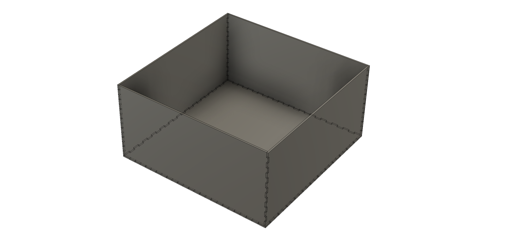

# Open field box

Open field box with internal dimensions: 23 x 23 x 11.5"

This is a parametric design of an open field box. Adjust dimensions using the `change parameters` menu in [Fusion 360][Fusion360] as needed and re-export laser cutting files using the `manufacture` menu.

## Components
- [6mm clear acrylic sheets](https://www.polymershapes.com/product/acrylic/)

## Assembly instructions
- Laser cut the acrylic sheets using the [provided CAD drawings](CAD). Remove protective film.
- Assemble all acrylic parts (except removable parts) using painter's tape and apply acrylic cement or 2-part epoxy.
- Remove painter's tape after drying.

## Version History
### 0.1.0
* 2024-01-22
  - Initial Release.

## License
© 2024 [Leonardo Molina][Leonardo Molina]

This project is licensed under the [Creative Commons BY-NC-SA 4.0 License](https://creativecommons.org/licenses/by-nc-sa/4.0/).

[Leonardo Molina]: https://github.com/leomol
[LICENSE.md]: LICENSE.md
[Fusion360]: https://www.autodesk.com/ca-en/products/fusion-360